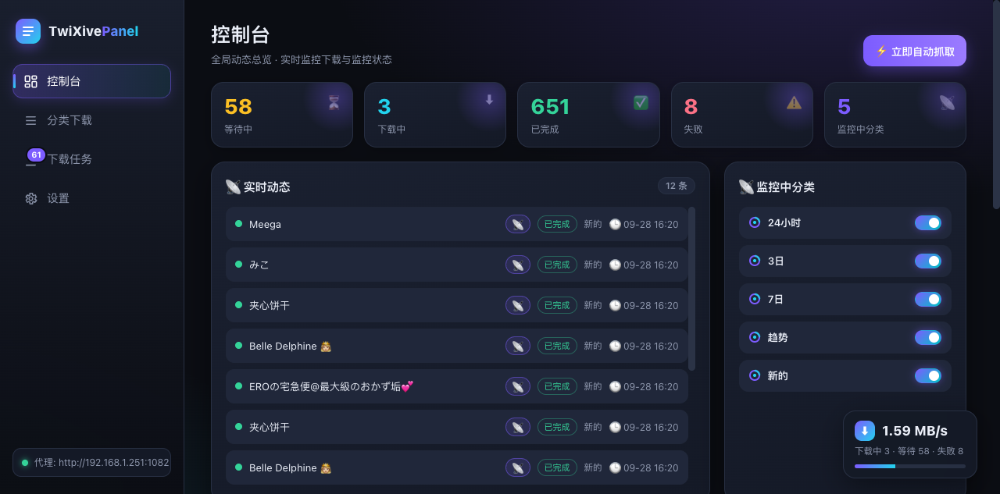
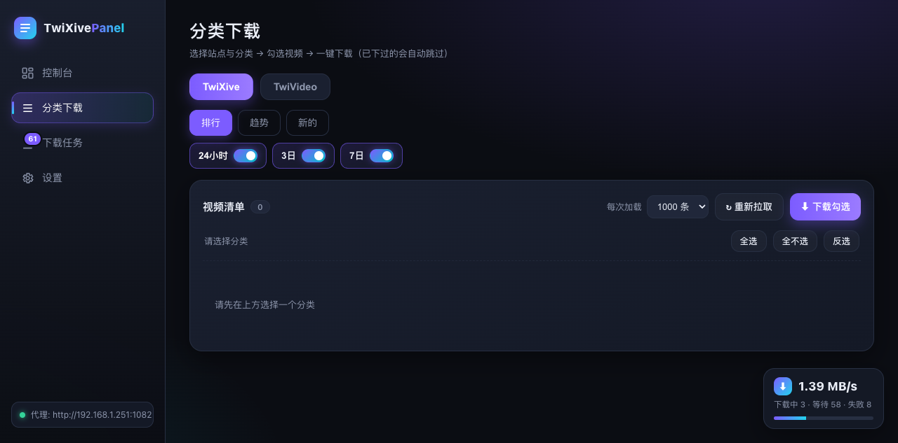
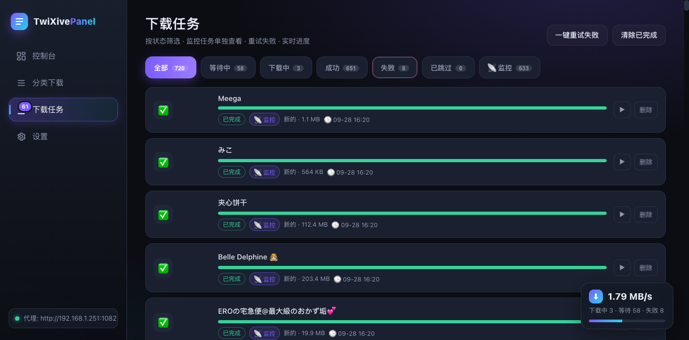
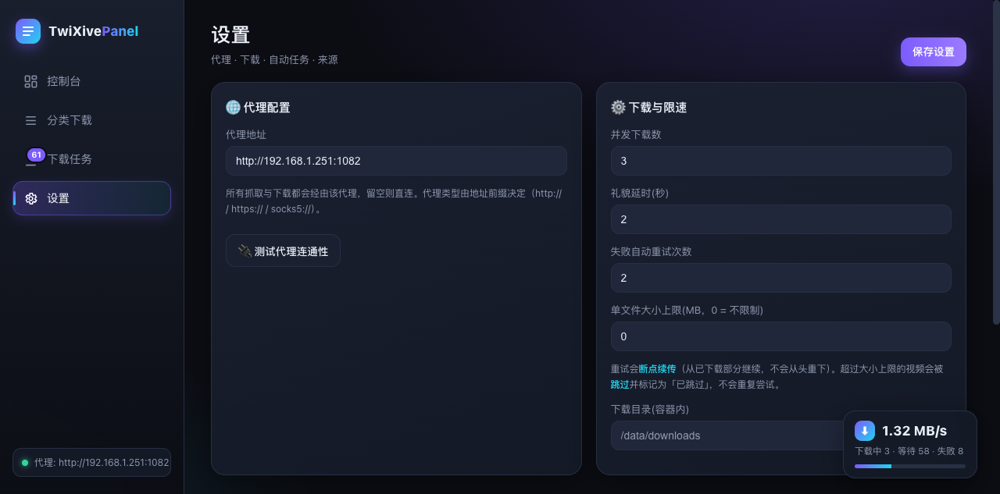
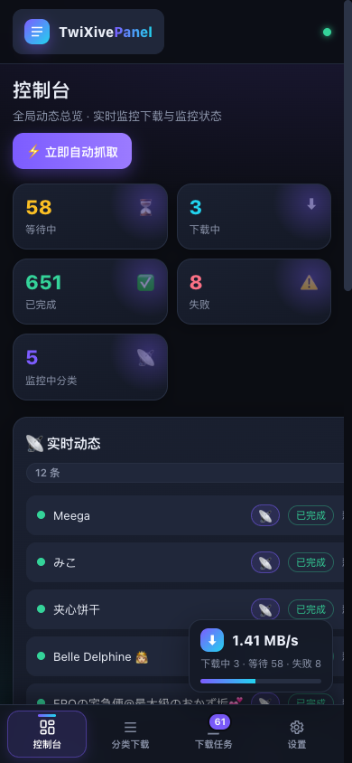

# TwiXive Panel · 视频下载管理面板

自托管的视频下载管理面板：**分类选择 → 勾选视频 → 一键/自动下载**。
FastAPI + SQLite + 原生前端，单容器部署，数据全部落在本地。

> ⚠️ 目标站点为 X/Twitter 成人视频聚合站（18+）。本工具仅做下载自动化，不绕过访问控制、
> 默认带礼貌限速；请仅下载你有权访问的内容，并遵守所在地区法律与站点条款。

## 功能

- 🎛️ 深色面板：控制台 / 分类下载 / 下载任务 / 设置 四个视图，手机端导航移至底部
- 🗂️ 两个来源大 Tab（TwiXive / TwiVideo），分类按站点真实导航分组
- 📦 大批量拉取：每次加载 100~1000 条可选，按 offset 分页不错位；已下载过的自动标记「已存在」并跳过
- 📡 分类监控：分类右侧的开关打开后，出现新视频自动入队下载（按地址去重，绝不重复下）；控制台**跨来源**汇总全部监控中的分类
- 💾 磁盘占用总览：控制台实时显示下载目录真实占用（扫盘统计）与所在磁盘剩余空间
- 🗑 删除即清理：删除任务 / 清除已完成时可连带删除源文件（含路径越界防护，默认开启、可关）
- ⚡ 断点续传 + 失败自动重试（退避）+ 单文件大小上限过滤
- 🌐 代理配置：HTTP / HTTPS / SOCKS5（由地址前缀决定），抓取与下载均走代理；带**总开关**（临时切直连不用重填地址），设置页一键测试连通性
- 🔥 代理熔断：代理连续失败自动全局暂停 2 分钟再探测，排队任务不会被批量烧成失败
- 📊 控制台总览：实时统计、动态流、监控中分类、正在下载进度
- 🚀 实时网速：后端逐块采样 + 指数平滑，悬浮窗常驻；导航栏角标显示进行中/失败数
- 🀄 全部报错中文化，一键重试全部失败

## 📸 截图

### 控制台



### 分类下载



### 下载任务



### 设置



### 手机端

<p align="center">
  
</p>

## 🚀 快速开始（Docker）

```bash
docker pull edisonxu123/twixive-panel:1.0

docker run -d \
  --name twixive-panel \
  -p 6523:8000 \
  -v /你的/下载目录:/data \
  -e TZ=Asia/Shanghai \
  --restart unless-stopped \
  edisonxu123/twixive-panel:1.0
```

打开 `http://<主机IP>:6523` 即可使用，无登录口令。
视频保存在挂载目录的 `downloads/` 下，数据库为同目录的 `app.db`。

或使用 docker-compose：

```yaml
services:
  twixive-panel:
    image: edisonxu123/twixive-panel:1.0
    container_name: twixive-panel
    ports:
      - "6523:8000"
    volumes:
      - ./videos:/data
    environment:
      - TZ=Asia/Shanghai
    restart: unless-stopped
```

NAS（群晖 / QNAP / fnOS 等）用 Container Manager 导入上面的 compose 或直接 SSH 执行 `docker run` 均可。

## 📖 使用方法

1. **选站点**：顶部切换 TwiXive / TwiVideo 大 Tab
2. **选分类**：点分组（排行 / 趋势 / 新的），再点子分类；每个子分类右侧有一个**监控开关**，打开后该分类的新视频会自动下载
3. **拉取**：右上角选择每次加载数量（100~1000），点「重新拉取」；列表下方「加载 N 条」继续往后翻
4. **批量下载**：勾选视频（已下载过的默认不勾并带「已存在」标记），点「下载勾选」；同一次提交内的重复地址后端也会自动跳过
5. **看进度**：右下角悬浮窗显示实时总网速与队列概况，点它直达下载任务页；导航栏「下载任务」角标显示进行中数量（有失败时变红）
6. **管理任务**：按状态 Tab 筛选，「监控」Tab 只看监控触发的任务；失败任务一键重试，支持断点续传
7. **删除任务**：默认勾选「删除时同时删源文件」——删除任务会把已下载的视频文件一并删掉并释放空间；只想删记录就取消勾选
8. **配置代理**：设置页填入代理地址，点「测试代理连通性」验证——视频 CDN 通常必须走代理才能访问；代理临时不可用时把「启用代理」开关关掉即可整体切直连，地址会保留

### 建议配置

| 配置项 | 建议值 | 说明 |
|---|---|---|
| 并发下载数 | 2~3 | 过高容易触发远端中断 |
| 失败自动重试次数 | 2~3 | 配合断点续传基本免看管 |
| 单文件大小上限(MB) | 100 | 按需；0 为不限制 |
| 礼貌延时(秒) | 2 | 避免对站点造成压力 |

## 🧱 本地运行（开发）

```bash
python -m venv .venv && source .venv/bin/activate
pip install -r requirements.txt
export DATA_DIR=./data
uvicorn app.main:app --host 0.0.0.0 --port 8000
```

## 目录结构

```
twixive-panel/
├── Dockerfile / docker-compose.yml   # 容器化
├── requirements.txt
├── docs/                             # 截图
└── app/
    ├── main.py        # FastAPI 路由
    ├── db.py          # SQLite 持久化
    ├── config.py      # 代理 / session
    ├── downloader.py  # 下载引擎（代理/并发/断点续传/大小上限/熔断）
    ├── scheduler.py   # 跨来源巡检 + 监控自动入队
    ├── errors.py      # 报错中文化
    ├── sources/       # 来源适配器（twixive / twivideo）
    └── static/        # 前端面板 (index.html/css/js)
```

## License

MIT
